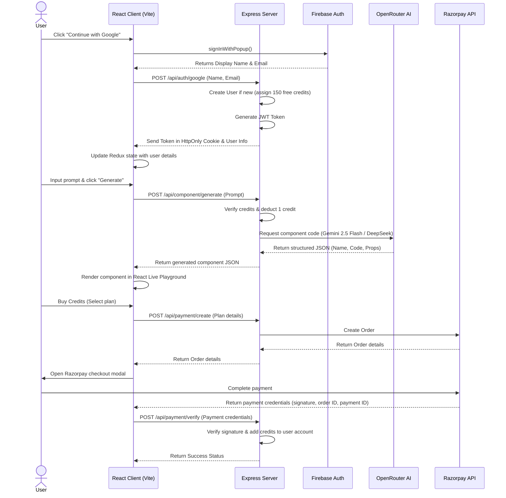

<p align="center">
  
</p>


# VirtualUI 🚀

VirtualUI is a premium, AI-powered React component library and generation platform. It allows developers to generate high-quality React components using natural language, customize props in real-time, preview them instantly, and publish them directly to a shared npm library package.

---

## 🌟 Key Features

*   **AI Component Generator:** Describe your desired UI in plain English and generate React components in seconds. Powered by OpenRouter (utilizing Google Gemini 2.5 Flash with DeepSeek Chat fallback).
*   **Live Preview & Playground:** Instantly preview AI-generated components and customize their React props live using a real-time playground built with `react-live`.
*   **Prebuilt Component Library:** Use beautiful, prebuilt UI components like calendar cards, charts, OTP inputs, custom search bars, and more out of the box.
*   **Admin Publishing Flow:** Admins can publish new components directly from the dashboard, which automatically bundles the component using `tsup`, updates the library exports, bumps the package version, and deploys it to the npm repository.
*   **Monetization & Credit System:** Includes integration with Razorpay to purchase AI generation credits, complete with secure transaction verification.
*   **Authentication & Role Management:** Firebase Google Auth integrated with cookie-based JWT sessions for role-based route protection.

---

## ⚙️ Tech Stack & Rationale

VirtualUI is built using a modern, scalable web stack structured as a monorepo-style codebase:

### 1. Frontend (`virtualui-client`)
*   **React 19 & Vite:** Next-gen frontend speed and rendering capabilities.
*   **Tailwind CSS v4:** Modern CSS framework for styling web dashboard utility pages.
*   **Redux Toolkit:** Predictable global state management for auth credits and components.
*   **React Live:** Enables compiling and rendering dynamic AI-generated JSX on the fly in the browser.
*   **Motion (Framer Motion):** Smooth micro-interactions and transitions.
*   **Sonner:** Modern toast notifications.

### 2. Backend (`virtualaui-server`)
*   **Node.js & Express:** Lightweight, fast backend framework.
*   **MongoDB & Mongoose:** Flexible document database to store users, payments, and component templates.
*   **JWT & Cookie Parser:** Secure, cookie-based authentication sessions.
*   **Razorpay SDK:** Seamless payment processing.
*   **OpenRouter API:** Access to state-of-the-art LLMs (Gemini, DeepSeek) for coding assistance.

### 3. Component Library (`virtualui-lib`)
*   **tsup:** Zero-config TypeScript/JavaScript bundler powered by esbuild to compile/package the components into clean ESM and CJS formats.
*   **TypeScript:** Type definitions for safe package exports.

---

## 🗺️ App Flow



---

## 🔒 Authentication Flow Detail

1.  **OAuth Popup:** The client uses Firebase SDK to trigger a Google Sign-In pop-up.
2.  **Backend Synced Registration:** Once credentials are recovered, they are sent to the server. The server verifies or registers the user in MongoDB.
3.  **Secure JWT Cookies:** The server generates a JSON Web Token (JWT) containing the user ID and sends it back to the client inside a secure, HttpOnly, `SameSite=strict` cookie.
4.  **Route Protection:** The React frontend checks the token's presence and validity via `/api/user/current-user`. Routes like `/admin` are wrapped under the [AdminRoute](file:///C:/Users/250210/Downloads/VirtualUI/VirtualUI/virtualui-client/src/components/AdminRoute.jsx) controller to prevent unauthorized access.

---

## 📂 Project Folder Structure

```
VirtualUI/
├── attachment_162633455.png       # Project Banner/Preview Image
├── README.md                      # Project Documentation
├── virtualaui-server/             # Express.js Backend
│   ├── configs/                   # DB Connection and Token Utilities
│   ├── controllers/               # Auth, Component, AI, and Payment Controllers
│   ├── middlewares/               # isAuth & isAdmin Authorization Guards
│   ├── models/                    # MongoDB Mongoose Schemas (User, Component, Payment)
│   ├── routes/                    # API Endpoints
│   ├── utils/                     # OpenRouter and Razorpay initializations
│   ├── .env                       # Backend Environment Configuration
│   └── index.js                   # Server Entry Point
│
├── virtualui-client/              # React + Vite Frontend
│   ├── public/                    # Static Assets
│   ├── src/
│   │   ├── components/            # Auth, Admin Route Protection, Live Preview
│   │   ├── pages/                 # Home, Generate, MyComponents, Pricing, Admin
│   │   ├── redux/                 # User & Component State Slices
│   │   ├── utils/                 # Firebase and Helper Utilities
│   │   ├── App.jsx                # Client Routes & State initialization
│   │   └── main.jsx               # Entry Point
│   ├── .env                       # Frontend Environment Configuration
│   └── vite.config.js             # Vite configuration with Tailwind CSS v4 support
│
└── virtualui-lib/                 # Bundled React Component Library (NPM Package)
    ├── src/
    │   ├── components/            # Exported UI Components (Buttons, Calendars, etc.)
    │   └── index.js               # Entry-point exporting all components
    ├── dist/                      # Compiled JS files (ESM / CommonJS formats)
    ├── package.json               # Package info & peer dependencies
    └── tsup.config.js             # Bundler options using tsup
```

---

## 🔑 Environment Variables

To run the application locally, you must configure environment files in both the server and client folders:

### Backend Configuration (`virtualaui-server/.env`)

```env
PORT=8000
MONGODB_URL="your-mongodb-connection-string"
JWT_SECRET="your-jwt-signing-secret"
OPENROUTER_API_KEY="your-openrouter-api-key"
RAZORPAY_KEY_ID="your-razorpay-key-id"
RAZORPAY_KEY_SECRET="your-razorpay-key-secret"
```

### Frontend Configuration (`virtualui-client/.env`)

```env
VITE_FIREBASE_APIKEY="your-firebase-api-key"
VITE_RAZORPAY_KEY_ID="your-razorpay-key-id"
```

---

## 🚀 Local Development Setup

### Prerequisite
Ensure you have Node.js (v18+) and MongoDB installed and running.

### 1. Clone & Setup Library
```bash
cd virtualui-lib
npm install
npm run build
```

### 2. Setup Server
```bash
cd ../virtualaui-server
npm install
# Ensure .env is populated
npm run dev
```

### 3. Setup Client
```bash
cd ../virtualui-client
npm install
# Ensure .env is populated
npm run dev
```

Your app will be running at `http://localhost:5173`, and the backend server at `http://localhost:8000`.
